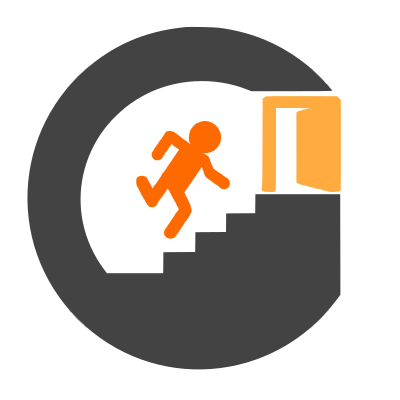
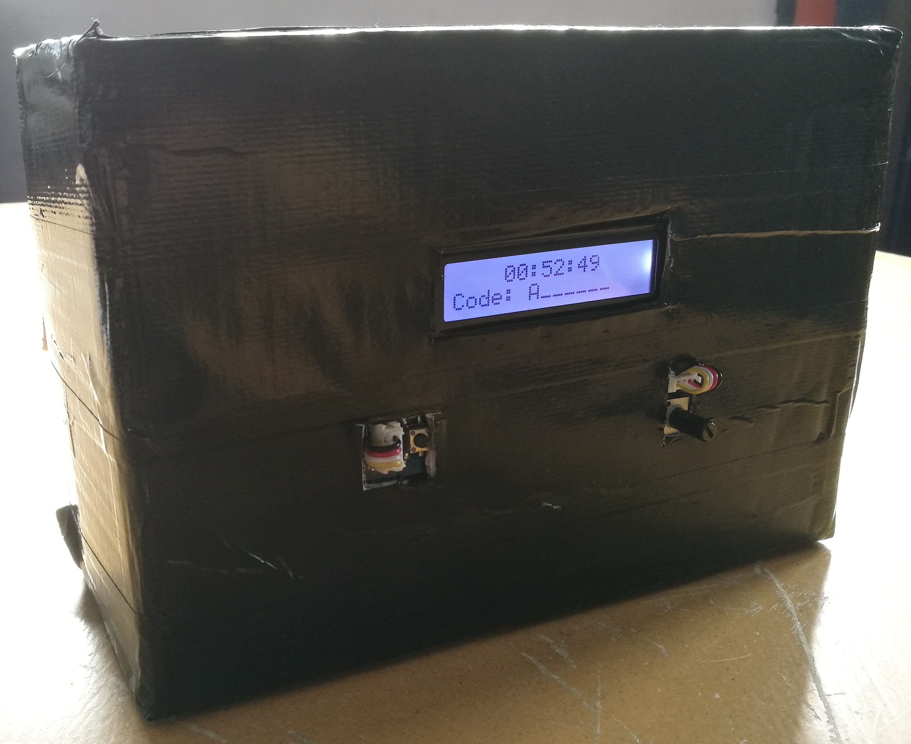

<div align="center">
    
    <h1>
        <b>
            DYG (Do Your Game)
        </b>
    </h1>
    <h3>Projet de fabrication d'une bombe fictive</h3>
</div>

<br/>

## Les origines
L'idée du projet met venu lorsque des amis et moi voulions réaliser un escape game. Nous avions commencé par chercher différents types de scénario avant de s'arrêter sur un. Ce scénario restait classique par rapport à un escape game: _"trouvez l'ensemble des éléments permettant de reconstituer un code afin de désactiver la bombe avant que celle-ci n'explose"_.

Le temps restant de l'escape game étant ainsi affiché sur la _pseudo-bombe_.

Je me suis ainsi proposé pour la réalisation de cette magnifique _pseudo-bombe_ (cette boîte noire comme vous pouvez le voir ci-dessous)

<div align="center">
    
</div>

## Objectifs
* Essayer de tout développer en orienté objet avec Arduino.
* Faire une interface fonctionnelle.
* Pouvoir ré-utiliser cette _pseudo bombe_ dans d'autres projets ou d'autre escape game.

## Fonctionnement
Dans sa version actuelle, la bombe s'active dès que celle-ci est alimentée.
Le code de désarmement et la temporisation sont programmables qu'en éditant le code source et en le recompilant.

Dès son alimentation, l'écran affiche le temps restant et la longueur du code attendu. Un __potentiomètre__ (à droite) permet de __modifier la lettre sélectionnée__. Un __bouton poussoir__ (à gauche) permet de __d'acquitter__ la lettre sélectionnée et de passer à la lettre suivante. Lorsque l'ensemble des trous sont remplis, si le code est correct (ça désactive la bombe) sinon le code est effacé et on peut recommencer.

## Définir le temps avant explosion
La définition du temps avant explosion s'effectue à l'initialisation de l'objet Clock (ligne 148) avec les paramètres suivants:
* hour     (int) : heures
* minute   (int) : minutes
* second   (int) : secondes

> Exemple
```arduino
Clock clocky {1, 0, 0}; // Définition pour 1 heure de jeu.
```

## Définir le mot de passe
La définition du mot de passe s'effectue à l'initialisation de l'objet PassWord (ligne 149) avec les paramètres suivants:
* alphabet (string) : liste de lettres constituant l'alphabet.
* mdp      (string) : mot de passe

> Exemple
```arduino
char alphabet[] = {'A','B','C','D','E','F','G','H','I','J','K','L','M','N','O','P','Q','R','S','T','U','V','W','X','Y','Z'};
PassWord pass {alphabet, "CESAR"}; // Définition du mot de passe "CESAR"
```